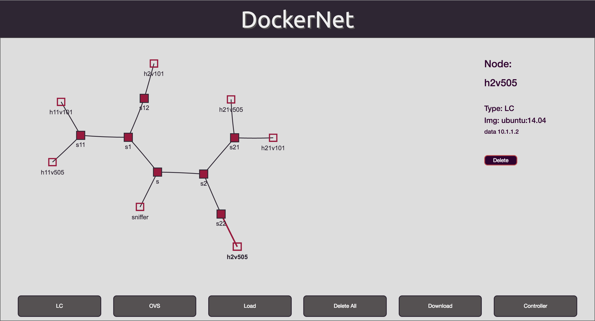

# DockerNet

### Overview

This simple python-based platform and a user-friendly web, called DockerNet.

It allows to create virtual networks based on containers (Docker) and OpenVSwitches in an easy way.

---

#### Dependencies

The list of dependencies can be checked in "install_dependencies.sh". To install it, simply run 

	"$ ./install_dependencies.sh"

and provide you username when required.

#### Installation

By simply running:

	"$ sudo python DockerNetRest.py"

"sudo" is required for OVS management.

For the website, the installation (_install_dependencies.sh_) provides Apache HTTP server. Copy all the files under the GUI folder to _/var/www/html/_ or to a folder inside it (e.g. _/var/www/html/dockernet/_).

If the website is intended to be accessed from outside the host computer, you will need to modify the var _hostip_ within _index.html_ and _stats/index.html_.

#### Usage / Capabilities

The main capabilities of this platform include:

* Run a new container in the host. To do so, it allows to select a new image from the available images within the host. If you require a new image, it should be imported via command line using _docker pull image:version_
* Create an OVS.
* Create a new link between two OVS by simply clicking both nodes in the network view.
* Create a new link between an OVS and a container by simply clicking both nodes in the network view. It will ask for the name of the interface in the container, an IP address and (optionally) a VLAN, which will be integrated within the OVS configuration (not in the container's interface). Note that if the OVS is attached to a controller, the VLAN configuration will not work.
* Download the current topology in a JSON file.
* Upload a previously downloaded (or manually created) topology.
* Delete any node or link in the topology.
* Delete the whole topology.
* Attach the OVSs to SDN controllers (providing the IP address of the controller).
* Attach an OVS to a physical interface. This capability might cause trouble if you do not consider carefully which interface you are attaching (e.g. by attaching the server's interface used to remotely access it, you will loose the connectivity). To sort this issue, we are including an "allowed-interfaces" configuration file.
* etc.

#### Error control notes

Please, note that this platform can be used for testing and to have a lower level view of what happens below the infrastructure. In this sense, there is not an developed error control within the platform, so a misusage of certain capabilities (e.g. sending a somehow mistaken topology JSON, configuring already existing IPs, duplicating interface names, etc.) might cause exceptions. 

### License

Copyright 2015 Center for Computational Simulation, Universidad Politecnica de Madrid.

Licensed under the Apache License, Version 2.0 (the "License"); you may not use this file except in compliance with the License. You may obtain a copy of the License at apache.org/licenses/LICENSE-2.0

Unless required by applicable law or agreed to in writing, software distributed under the License is distributed on an "AS IS" BASIS, WITHOUT WARRANTIES OR CONDITIONS OF ANY KIND, either express or implied. See the License for the specific language governing permissions and limitations under the License.